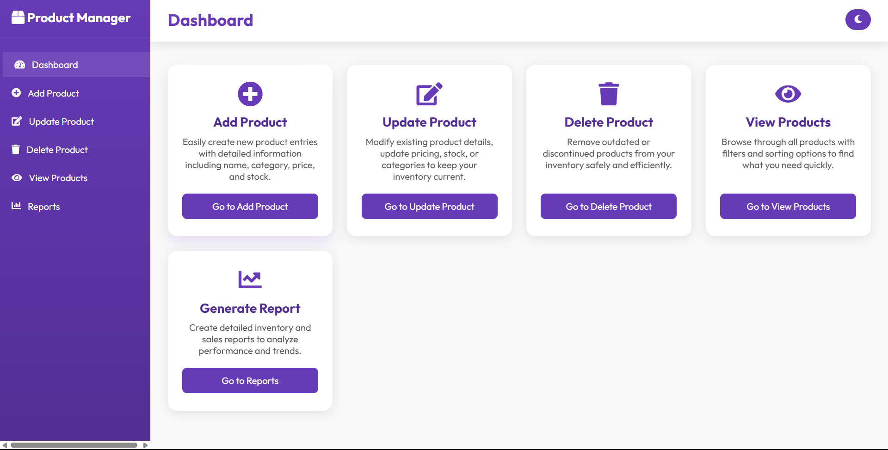
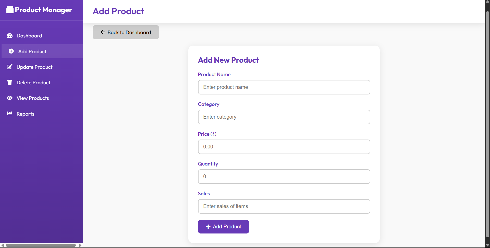
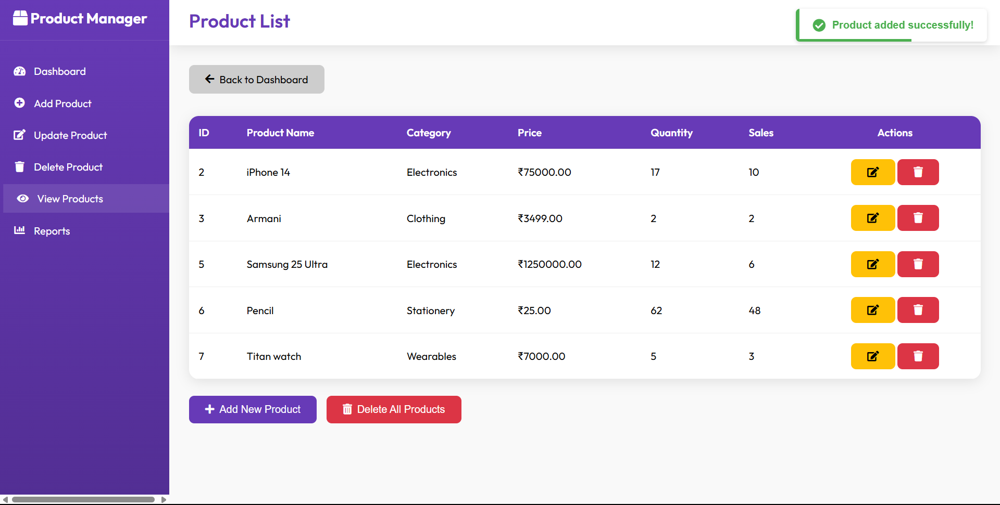
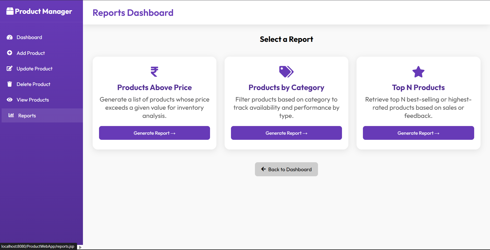
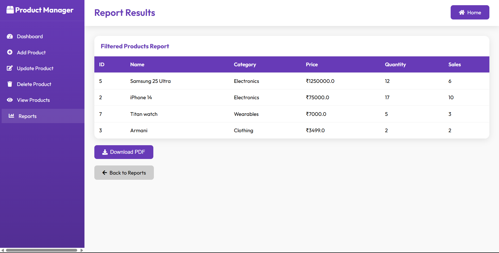

# **Product Management System**

**Subject Name**: Advanced Java  
**Subject Code**: BCS613D  
**Name**: Shetty Vinith Vijay  
**USN**: 4AL22CS144  
**Sem/Section**: VI/C  

A comprehensive web application for managing product inventory, sales data, and business reports built with JSP, Servlets, and MySQL following MVC architecture principles.

## 🚀 Features

* **Product Management**: Complete CRUD operations for product records
* **Category Management**: Organize products by categories
* **Inventory Control**: Manage stock quantities and track inventory levels
* **Sales Tracking**: Record sales data per product
* **Product Reports**: Generate various reports including:
   * Products above a specific price
   * Products by category
   * Top N products by price, quantity, or sales
* **Search Functionality**: Search products by ID, name, or category
* **Professional UI**: Responsive design with modern dashboards and tables
* **PDF Report Generation**: Download product reports as PDF documents
* **MVC Architecture**: Clean separation of concerns
* **Database Integration**: MySQL with JDBC connectivity

## 📋 Prerequisites

Before running this application, make sure you have the following installed:

* **Java Development Kit (JDK) 8 or higher**
* **Apache Tomcat 9.0 or higher**
* **MySQL Server 5.7 or XAMPP Server**
* **MySQL JDBC Driver (mysql-connector-java)**
* **IDE**: Eclipse (J2EE), IntelliJ IDEA, or any Java IDE
* **Web Browser**: Chrome, Firefox, or Edge

## 🛠️ Project Structure
```
ProductManagementSystem/
├── src/
│ ├── dao/
│ │ └── ProductDAO.java
│ ├── model/
│ │ └── Product.java
│ ├── servlet/
│ │ ├── AddProductServlet.java
│ │ ├── UpdateProductServlet.java
│ │ ├── DeleteProductServlet.java
│ │ ├── DisplayProductsServlet.java
│ │ ├── ReportServlet.java
│ │ └── ReportCriteriaServlet.java
├── WebContent/
│ ├── index.jsp
│ ├── productadd.jsp
│ ├── productupdate.jsp
│ ├── productdisplay.jsp
│ ├── reports.jsp
│ ├── report_form.jsp
│ ├── report_result.jsp
│ ├── css/
│ │ └── style.css
├── WEB-INF/
│ └── web.xml
└── README.md
```

## 🗄️ Database Setup

### 1. Create Database

```sql
CREATE DATABASE IF NOT EXISTS productdb;
USE productdb;
```

### 2. Create Tables

```sql
CREATE TABLE IF NOT EXISTS products (
    productId INT PRIMARY KEY AUTO_INCREMENT,
    productName VARCHAR(100) NOT NULL,
    category VARCHAR(50),
    price DECIMAL(10,2),
    quantity INT,
    sales INT,
    created_at TIMESTAMP DEFAULT CURRENT_TIMESTAMP
);

```
3. Insert Sample Data
   
```sql
INSERT INTO products (productName, category, price, quantity, sales) VALUES 
('Laptop', 'Electronics', 75000.00, 50, 250),
('Phone', 'Electronics', 30000.00, 80, 600),
('Chair', 'Furniture', 2500.00, 200, 150),
('Table', 'Furniture', 4500.00, 100, 120),
('Watch', 'Accessories', 5000.00, 70, 90);
```

## ⚙️ Installation & Setup

### Step 1: Clone/Download the Project
Download all the project files and organize them according to the project structure above.

### Step 2: Database Configuration
- Start your MySQL server
- Run the database setup scripts provided above
- Update database credentials in `ProductDAO.java`:
  
```java
public class ProductDAO {
    private static final String URL = "jdbc:mysql://localhost:3306/productdb";
    private static final String USERNAME = "your_username";
    private static final String PASSWORD = "your_password";
    
    public static Connection getConnection() throws SQLException {
        return DriverManager.getConnection(URL, USERNAME, PASSWORD);
    }
}

```
### Step 3: Add MySQL JDBC Driver
1. Download MySQL Connector/J from the official MySQL website
2. Add the JAR file to your project's `WEB-INF/lib` directory
3. If using an IDE, add it to your build path

### Step 4: Deploy to Tomcat
1. Create a new Dynamic Web Project in your IDE
2. Copy all source files to the appropriate folders
3. Deploy the project to Tomcat server
4. Start the Tomcat server

### Step 5: Access the Application
Open your web browser and navigate to:
```
http://localhost:8080/ProductManagement/
```

## 💼 Application Modules
### Product Management
- Add new products with name, category, price, quantity, and sales data
- Update product information and inventory quantities
- View complete product list with search and sort options
- Delete products from the database

### Reports & Analytics
- Products priced above a given value
- Products by selected category
- Top N products sorted by:
  - Price
  - Quantity
  - Sales volume
-Download reports as PDF files

### Sales Management
- Track total sales per product
- Generate top-selling product lists

## 📸 Screenshots
### Dashboard

*Main dashboard displaying quick access to all product management modules and reports.*

### Employee Management

*Form interface to add new products with fields for name, category, price, quantity, and sales.*


*Page displaying all products in the database with options to update, delete, and view details.*

### Salary Structure

*Module to select report criteria like price range, category, or top-selling products.*

### Reports Dashboard

*Report result page displaying filtered products based on selected criteria, with PDF download option.*

## 🔧 Configuration
### Database Connection Properties
Update the following properties in `ProductDAO.java`:
- **Database URL**: `jdbc:mysql://localhost:3306/ProductManagement`
- **Username**: Your MySQL username
- **Password**: Your MySQL password

### Server Configuration
- **Default Port**: 8080
- **Context Path**: `/ProductManagementSystem`
- **Session Timeout**: 30 minutes

## 📱 Usage
1. **Add Product**: Insert new product details into inventory
2. **Update Product**: Modify existing product information and stock
3. **View Products**: Display all products with details
4. **Delete Product**: Remove product records
5. **Generate Reports**: Filter and generate reports based on price, category, or sales
6. **Download Reports**: Export product data reports as PDF files

## 🔐 Security Features
- Input validation and sanitization
- SQL injection prevention
- Session management
- Secure sales and product data handling

## 🤝 Contributing
1. Fork the project
2. Create your feature branch (`git checkout -b feature/AmazingFeature`)
3. Commit your changes (`git commit -m 'Add some AmazingFeature'`)
4. Push to the branch (`git push origin feature/AmazingFeature`)
5. Open a Pull Request

## 📝 License
This project is licensed under the MIT License - see the LICENSE file for details.

## 📞 Contact
- **Shetty Vinith Vijay**
- Email: vinithshetty9372@gmail.com
- USN: 4AL22CS144

## 🙏 Acknowledgments
- hanks to the Advanced Java course instructors
- Bootstrap for the responsive UI framework
- MySQL for the robust database system
- Apache Tomcat for the web server
- iText library for PDF generation
